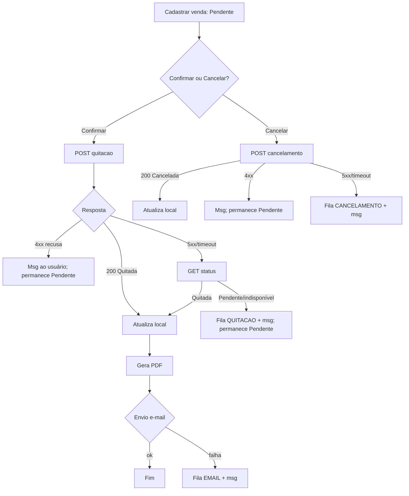

# PRD-TECNICO — ERP Vendas (Delphi) — RASCUNHO v0.1 (2026-09-21)

Base: `PRD.md` + `VISAO-PRODUTO.md`. Marcas: [OBR] requisito do desafio; [SUG] sugestão do autor. EARS: "Quando/Se ... o sistema deve ...". Sem decisões de arquitetura aqui (ver Seção 5 e premissas).

## 1. Requisitos Funcionais (critério de aceite EARS)

### Clientes
- **RF-01 [OBR]** CRUD de clientes (incluir, alterar, excluir, consultar). Campos: nome/razão social, tipo pessoa (F/J), CPF/CNPJ, endereço, telefone, e-mail, ativo.
  - CA: Quando o usuário salvar cliente com campos obrigatórios válidos, o sistema deve persisti-lo e exibi-lo na consulta.
  - CA: Se nome, CPF/CNPJ ou e-mail estiver vazio, o sistema deve recusar o salvamento e indicar o campo.
- **RF-02 [SUG]** Validação de CPF/CNPJ (dígitos verificadores) e formato de e-mail.
  - CA: Se CPF/CNPJ for inválido ou e-mail malformado, o sistema deve bloquear o salvamento com feedback visual.
- **RF-03 [SUG]** CPF/CNPJ único.
  - CA: Se já existir cliente com o mesmo documento, o sistema deve recusar o cadastro.
- **RF-04 [SUG]** Cliente com vendas vinculadas é inativado, não excluído.
  - CA: Quando o usuário excluir cliente com vendas, o sistema deve inativá-lo e informar isso.

### Produtos
- **RF-05 [OBR]** CRUD de produtos (descrição, unidade, preço unitário, categoria, ativo).
  - CA: Se preço < 0 ou descrição/unidade vazia, o sistema deve recusar o salvamento.
- **RF-06 [SUG]** Produto com vendas vinculadas é inativado.
  - CA: Quando excluir produto usado em venda, o sistema deve inativá-lo.

### Vendas
- **RF-07 [OBR]** CRUD de vendas mestre/detalhe (cliente, data, itens, total, status).
  - CA: Quando o usuário salvar venda com cliente e >= 1 item, o sistema deve criá-la com status Pendente.
- **RF-08 [SUG]** Validações: cliente ativo, produto ativo, quantidade > 0, >= 1 item.
  - CA: Se alguma condição falhar, o sistema deve recusar o salvamento e indicar o motivo.
- **RF-09 [SUG]** valorTotal = Σ(quantidade × preço unitário), calculado, nunca digitado.
  - CA: Quando itens mudarem, o sistema deve recalcular o total; o campo deve ser somente leitura.
- **RF-10 [SUG]** Preço unitário do item copiado do produto no momento da venda (snapshot).
  - CA: Quando o preço do produto mudar depois, o sistema deve manter o preço dos itens já gravados.
- **RF-11 [SUG]** Só Pendente é editável/excluível; Quitada/Cancelada é somente leitura.
  - CA: Se o status não for Pendente, o sistema deve impedir edição e exclusão.

### Integração e fluxo de quitação
- **RF-12 [OBR]** Confirmar venda envia POST `/api/vendas/quitacao` ao Financeiro.
  - CA: Quando o usuário confirmar venda Pendente, o sistema deve enviar vendaId, clienteId, valorTotal e itens conforme contrato v1.0.
- **RF-13 [OBR]** Resposta 200 "Quitada" atualiza a venda local.
  - CA: Quando o Financeiro responder Quitada, o sistema deve gravar status Quitada e dataQuitacao, e então gerar o PDF e enviar o e-mail.
- **RF-14 [SUG]** Falha/timeout: venda permanece Pendente e entra na fila.
  - CA: Se houver timeout ou 5xx, o sistema deve manter Pendente, registrar item na fila e exibir mensagem clara sem travar a aplicação.
- **RF-15 [SUG, depende de DEC-08]** Recusa 4xx.
  - CA: Se o Financeiro responder 4xx com corpo de erro, o sistema deve exibir a mensagem, manter Pendente e não reenfileirar.
- **RF-16 [OBR]** Cancelamento envia POST `/api/vendas/cancelamento`.
  - CA: Quando o usuário cancelar venda Pendente e o Financeiro responder Cancelada, o sistema deve gravar status Cancelada (e motivo, se informado).
- **RF-17 [SUG, depende de DEC-09]** Só Pendente pode ser cancelada.
  - CA: Se a venda não for Pendente, o sistema não deve oferecer/enviar o cancelamento.
- **RF-18 [SUG]** Reconciliação: após timeout na quitação, consultar GET `/api/vendas/{id}/status` antes de reenviar.
  - CA: Quando o status retornado for Quitada, o sistema deve concluir o fluxo local sem reenviar a quitação.

### Relatório e e-mail
- **RF-19 [OBR]** Relatório de confirmação de pedido (ReportBuilder): dados da venda, cliente, itens, total, status.
  - CA: Quando a venda for quitada, o sistema deve gerar o relatório com dados consistentes com o registro.
- **RF-20 [SUG]** Exportar em PDF (necessário ao anexo).
  - CA: Quando o relatório for gerado, o sistema deve produzir arquivo PDF legível.
- **RF-21 [OBR]** E-mail automático após confirmação de quitação, ao e-mail do cliente, com o relatório.
  - CA: Quando a quitação for confirmada pelo Financeiro, o sistema deve enviar e-mail com o PDF ao endereço do cliente.
  - CA: O sistema não deve enviar e-mail antes da confirmação de quitação.
- **RF-22 [SUG]** Falha de e-mail não trava o fluxo.
  - CA: Se o envio falhar, o sistema deve manter a venda Quitada, registrar item EMAIL na fila e informar o usuário.
- **RF-23 [SUG]** Fila de reenvio com tela de pendências e botão "Reenviar" (sem reprocessamento automático nesta fase).
  - CA: Quando o usuário acionar reenviar, o sistema deve reprocessar o item, incrementar tentativas, registrar último erro e marcar CONCLUIDO em caso de sucesso.

### Suporte
- **RF-24 [SUG]** Exceções tratadas centralmente, mensagem amigável ao usuário e detalhe técnico em log de arquivo.
  - CA: Se ocorrer exceção não tratada, o sistema deve exibir mensagem amigável e gravar detalhe no log.
- **RF-25 [OBR]** Entregáveis: README (instalação, configuração, dependências), DDL, `.FBK`, executável + DLLs.
  - CA: Em pasta limpa, seguindo só o README, o sistema deve instalar, conectar ao banco e executar o fluxo principal.
- **RF-26 [SUG]** Mock do Financeiro com modo falha/timeout, seguindo o contrato.

## 2. Requisitos Não-Funcionais
- **RNF-01 [OBR]** Stack: Delphi (13/12.x/10.3), FireDAC, Firebird 3.0, DevExpress VCL, ReportBuilder, API REST JSON.
- **RNF-02 [SUG]** Custo zero de licenças; evitar recursos exclusivos de Delphi recente enquanto DEC-02 estiver aberta.
- **RNF-03 [SUG]** Timeout configurável para o Financeiro (padrão 10 s); a UI deve sinalizar espera.
- **RNF-04 [SUG]** Configuração externalizada em INI (conexão, URL, timeout, SMTP); INI real fora do versionamento, só `.ini.example`.
- **RNF-05 [SUG]** Valores monetários exatos (2 casas); JSON com ponto decimal, UTF-8, datas ISO 8601, independente de locale pt-BR.
- **RNF-06 [OBR, implícito nos critérios]** Separação em camadas e código limpo, documentado (decisoes.md).
- **RNF-07 [SUG]** Banco do Vendas segregado do Financeiro; única ponte é a API.
- **RNF-08 [SUG]** Sem credenciais/chaves de licença no repositório.
- **RNF-09 [SUG]** Envio síncrono com timeout curto (DEC-14 proposta).

## 3. Regras de Negócio (com racional)
| ID | Regra | Racional |
|---|---|---|
| RN-01 | Venda nasce Pendente | Quitação depende do Financeiro |
| RN-02 | Só Pendente é editável/excluível/cancelável | Consistência com o Financeiro; estorno é outro processo (DEC-09, a confirmar) |
| RN-03 | Cliente ativo, produto ativo, qtd > 0, >= 1 item | Integridade da venda |
| RN-04 | Total calculado, preço em snapshot | Evita divergência e adulteração; histórico correto |
| RN-05 | Cliente/produto vinculado é inativado, não excluído | Preservar histórico |
| RN-06 | E-mail só após quitação confirmada [OBR] | Exigência do desafio |
| RN-07 | Falha externa nunca trava o fluxo; é registrada para reenvio | Resiliência |
| RN-08 | Recusa 4xx não reenfileira; 5xx/timeout reenfileira | Erro de negócio não se resolve com retentativa |
| RN-09 | "Sincronização pendente" não é status da venda; derivada da fila | Manter os 3 status do contrato |
| RN-10 | Status válidos: Pendente, Quitada, Cancelada | Mapeamento 1:1 com o contrato |

## 4. Fluxos de Usuário/Processo

Fluxos alternativos a detalhar depois: reprocessamento da fila (manual; automático só se sobrar tempo), cliente/produto inativado, e-mail do cliente inexistente/inválido. Telas ficam para o UX.

## 5. Dependências e Integrações
- **Financeiro C# (REST JSON)**, contrato v1.0: POST `/api/vendas/quitacao`, POST `/api/vendas/cancelamento`, GET `/api/vendas/{vendaId}/status`. v1.1 (C1-C8: formato de erro, códigos HTTP, idempotência, enum de status, base URL configurável, serialização) é PROPOSTA.
- **SMTP** (Mailtrap/Ethereal em dev; DEC-13 proposta), TLS/OpenSSL a testar cedo.
- **Firebird 3.0** e **FireDAC**; **DevExpress VCL**; **ReportBuilder**.
- Dependências entre requisitos: RF-13 -> RF-19/20 -> RF-21; RF-14/22 -> RF-23; RF-12 depende de RF-07; RF-18 depende de GET status; RF-15/RF-17 dependem de P-03/P-04; RF-26 desbloqueia RF-12 a RF-23 sem o C#; RF-25 depende de todos.
- Propostas para o Coordenador avaliar (não decididas aqui): 3 camadas + composition root, repositórios híbridos, estrutura de pastas, modelo de dados (CLIENTES, PRODUTOS, VENDAS, VENDA_ITENS, FILA_INTEGRACAO), DEC-03/04/05/06/07/10/14.

## 6. Premissas e Riscos Resolvidos
Resolvidas por decisão/informação do autor: DEC-01 Firebird 3.0 segregado (P-10); DEC-12 prazo de desenvolvimento sex 25/09 (P-06); P-02 trial não expira antes da entrega/avaliação (risco baixo, mitigado; registrar validade na T01). Em validação (PRD Seção 6): P-01 (DEC-02, D1), P-03 (DEC-08) e P-04 (DEC-09) e P-05 (contrato v1.1), todas com confirmação do contato C# até 23/09; P-07 (SMTP, até 22/09); P-08 (C# atrasar: D4/D5).

## 7. Interpretações Registradas
- INT-01: "Relatório de confirmação de pedido" interpretado como PDF gerado após quitação e anexado ao e-mail (o PDF cobre a exigência de anexo).
- INT-02: "Excluir" em cliente/produto com vendas = inativar (RN-05), para preservar histórico.
- INT-03: Estado "sincronização pendente" é derivado da fila, sem novo status de venda.
- INT-04: Falha de e-mail após quitação não reverte a quitação; venda fica Quitada com pendência de e-mail.
- INT-05: Sem cancelamento de venda Quitada no MVP (DEC-09).
- INT-06: Itens [SUG] só entram após os P0; cortes assumidos: sem acabamento de UI, fila só com "Reenviar", sem reprocessamento automático, roteiro de testes enxuto. D4 (24/09) = feature freeze.
